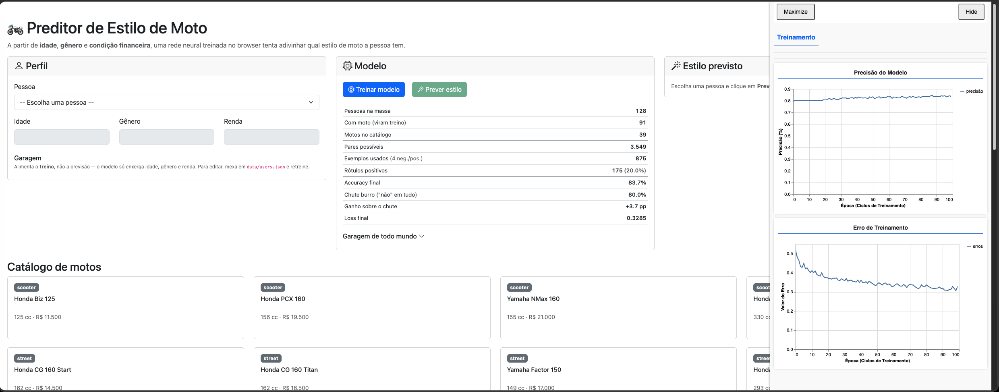

# Preditor de Estilo de Moto

A partir de informações básicas de uma pessoa — **idade**, **gênero** e **condição
financeira** — uma rede neural treinada no browser com TensorFlow.js tenta prever
**qual estilo de moto** ela tem.

O nome não entra no modelo: é identificador, não característica.



Da esquerda para a direita: o **perfil** da pessoa selecionada e a garagem dela,
o painel do **modelo** com o diagnóstico do treino, e o **estilo previsto**. O
painel do tfjs-vis abre sozinho durante o treino com as curvas de precisão e erro
por época.

## Rodar

```
npm install
npm start
```

Abre em `http://localhost:3000`.

## Estrutura

```
data/
  motos.json        catálogo — 39 motos em 8 estilos
  users.json        massa de treino — 120 pessoas (gerada)
  convidados.json   perfis de teste, sem moto  ← edite aqui pra brincar
scripts/
  generate-data.js  gerador determinístico da massa
src/
  view/             DOM e templates
  controller/       liga views e services
  service/          acesso aos dados
  workers/          treino e predição (thread separada)
  events/           event bus via CustomEvent
```

## Massa de treinamento

```
node scripts/generate-data.js
```

Gera `data/motos.json` e `data/users.json`. É determinístico: mesma `SEED`, mesma
massa. Todos os parâmetros de tuning ficam no bloco `PARÂMETROS` no topo do script.

Regras de negócio da geração:

| condição financeira | motos | teto de preço |
| --- | --- | --- |
| `muito_baixa` | 0 | — |
| `baixa` | 0 a 1 | R$ 22.000 |
| `media` | 1 a 3 | R$ 65.000 |
| `alta` | 2 a 4 | sem teto |

Idade e condição financeira são os sinais fortes. Gênero é deliberadamente um
sinal fraco — está lá pra rede ter o que aprender sem que a massa vire caricatura.

## Perfis de teste

`data/convidados.json` é uma lista de pessoas **sem moto nenhuma**. Elas aparecem
no topo do select, ficam de fora do treino (o modelo só treina com quem tem moto)
e são exatamente os casos que queremos prever.

Pra adicionar alguém, basta acrescentar um objeto:

```json
{
    "id": 909,
    "name": "Fulano de Tal",
    "age": 33,
    "gender": "masculino",
    "financialStatus": "alta",
    "purchases": []
}
```

Valores aceitos — `gender`: `feminino`, `masculino`. `financialStatus`:
`muito_baixa`, `baixa`, `media`, `alta`. Use `id` a partir de 900 pra não
colidir com a massa de treino.

## Como o modelo funciona

O treino é sobre **pares (pessoa, moto)**. Para cada pessoa que tem moto, cruzamos
o perfil dela com todas as 39 motos do catálogo: rótulo 1 se a moto está na
garagem, 0 caso contrário. A rede (`128 → 64 → 32 → 1 sigmoid`) aprende a dar uma
nota de afinidade de 0 a 1 para cada par.

Na predição, agregamos as notas por estilo (média das 3 melhores motos do estilo)
e o estilo com a maior nota é a resposta.

Vetores de entrada:

- **pessoa** (7 números): idade normalizada + one-hot de gênero + one-hot de renda
- **moto** (11 números): preço + cilindrada + idade média de quem tem + one-hot de estilo

## A garagem não entra na previsão

O vetor da pessoa é montado **só com o perfil**. A garagem dela não aparece ali —
ela serve para gerar os **rótulos** do treino, e nada mais. Duas consequências:

1. Funciona para quem não tem moto nenhuma, que é o caso de uso principal.
2. Duas pessoas com o mesmo perfil recebem sempre a mesma previsão.

Por isso a garagem é **somente leitura** na interface. Editá-la ali não mudaria
previsão alguma até um retreino, e um botão que sugere o contrário mente sobre o
que o sistema faz. Para mexer na massa, edite `data/users.json` (ou o gerador) e
clique em **Treinar modelo**.

Isso também eliminou um **vazamento de rótulo** que existia no código original: lá
o vetor do usuário era a média dos vetores das compras dele, e o rótulo era "o
usuário comprou este produto". Para quem tinha uma compra só, o vetor de entrada
era idêntico ao vetor do item rotulado como 1 — bastava comparar os dois para
acertar sempre, sem aprender nada. A resposta estava escondida dentro da pergunta.

Se um dia quiser que a garagem influencie a previsão, o caminho correto é
*leave-one-out*: ao montar o exemplo do par (Ana, Gold Wing), calcular o vetor da
Ana com a garagem dela **menos** a Gold Wing. Somar a garagem direto ao vetor traz
o vazamento de volta.

## Negative sampling

Cruzar cada pessoa com o catálogo inteiro dá 3.549 pares, dos quais só 175 são
positivos — **4,9%**. Com esse desbalanceamento a rede acha um atalho: responder
"não" para tudo já acerta 95,1% e chega a uma loss de ~0,20. Curvas lindas no
tfjs-vis, modelo inútil. E com batch de 32, uma em cada cinco batches não tem
nenhum positivo — nesses passos não há contraste algum para aprender.

A correção está em `createTrainingData`: para cada moto que a pessoa tem,
sorteamos `NEGATIVES_PER_POSITIVE` motos que ela não tem, em vez de usar as 39.

|  | sem sampling | com k=4 |
| --- | --- | --- |
| exemplos | 3.549 | 875 |
| positivos | 4,9% | 20,0% |
| positivos por batch | 1,58 | 6,40 |
| batches sem positivo | 19,8% | 0,08% |
| chute burro acerta | 95,1% | 80,0% |

Por que é legítimo: os zeros não são fatos observados. "Ana não tem uma Gold Wing"
não quer dizer que ela rejeitou a Gold Wing — é ausência de informação. O conjunto
de negativos é presumido e essencialmente infinito, e o que a rede precisa é do
**contraste** entre o que a pessoa tem e uma amostra do que ela não tem.

O preço é que o score deixa de ser probabilidade calibrada. Não afeta este app,
que só usa a **ordem** dos scores e a média por estilo — e a subamostragem
uniforme preserva a ordem. Se precisar da probabilidade real, subtraia `log(k)`
do logit antes da sigmoid.

`NEGATIVES_PER_POSITIVE` fica no topo do worker, junto com os `WEIGHTS`. Suba pra
40 e o desbalanceamento volta.

## Lendo o painel Modelo

O painel mostra **duas** métricas, e elas medem coisas diferentes. A de cima é a
que importa.

### Acerto de estilo — o que o app entrega

**Hit-rate top-1**: para cada pessoa da massa que tem moto, o estilo previsto está
entre os estilos que ela realmente tem? Vem acompanhado de dois baselines:

```
chutar a moda      22,0%   sempre responder o estilo mais comum da massa
chutar ao acaso    12,5%   1 em 8 estilos
```

O teto medido é **53,8%** — a acurácia de um oráculo que decora, para cada balde
de perfil (faixa etária × gênero × renda), a distribuição exata de estilos. Nenhum
modelo com essas três features pode fazer melhor.

É medido **na própria massa de treino**, então é otimista: serve para comparar
regimes (mudou o `k`? mudou os `WEIGHTS`?) e para comparar com os baselines, não
como estimativa de desempenho em gente nova. Separar um conjunto de teste é o
próximo passo natural.

### Classificação de pares — tarefa interna

É a `accuracy` que o `model.fit` reporta, sobre a pergunta "esta pessoa tem ESTA
moto?". Vem com o **chute burro** ("não" para tudo) ao lado e o **ganho sobre o
chute** entre os dois.

Esse ganho é pequeno por construção, e não adianta persegui-lo. Duas pessoas com
o mesmo perfil são idênticas para o modelo, mas uma tem uma MT-07 e a outra uma
Ninja 400 — na massa, pessoas do mesmo balde concordam só **6,5%** nas motos
específicas contra **20,5%** nos estilos. O rótulo por par é irredutivelmente
ruidoso.

Para dimensionar: com esta massa o chute burro dá 80,0%, um oráculo que decora o
balde dá 82,5% no corte de 0,5 e 87,7% no melhor corte possível. Um modelo em
83,7% já está acima do oráculo e a 4 pontos do teto absoluto. Não há espaço ali.

**Resumo**: se o hit-rate de estilo estiver bem acima da moda, o modelo funciona —
mesmo que o ganho sobre o chute na tarefa de pares pareça modesto.
